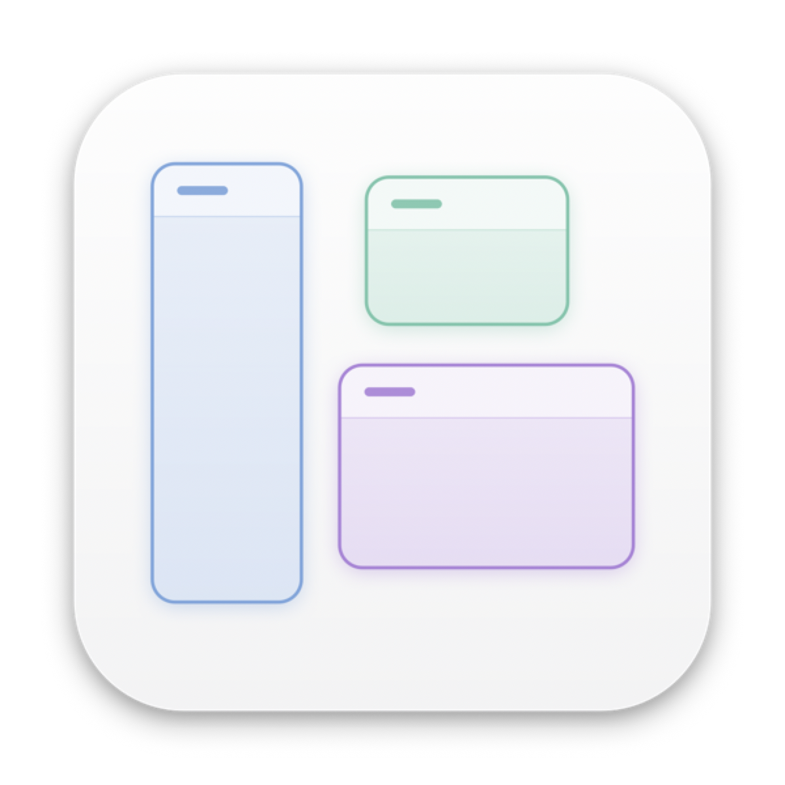
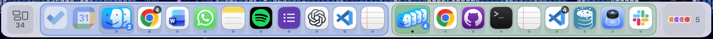

<p align="center">
  
</p>

<h1 align="center">WindowDeck</h1>

<p align="center">
  A macOS Dock replacement that groups <b>individual windows</b> rather than apps.
</p>

<p align="center">
  
  
  
</p>

One horizontal strip along the bottom of the screen showing **every open window at once**, bucketed
into a capsule per group — Main, Work, Study, or whatever you call them — each tinted with its group's
colour. Two windows of the same application can live in different capsules, and clicking a tile raises
that one exact window rather than whatever the app last had in front.

<p align="center">
  
</p>

<p align="center">
  <sub>
    34 windows in one bar. The button on the left carries the total; two capsules follow, then an
    overflow control — a dot per folded group, and the number of windows they hold between them.
    Badges mark several windows collapsed behind one icon: a hand-made <b>cluster</b> at the head of
    the green capsule, <b>app stacks</b> elsewhere. The filled tile is the window in focus, and its
    capsule is the one the next window will open in.
  </sub>
</p>

---

## Why

macOS offers two ways to organise a workspace, and neither works at the level people actually think at.

The Dock is **app-level**: it can bring Word forward, but not *the document you were writing*. Spaces
are **desktop-level**: a window belongs to one virtual desktop, moving between them takes over the
whole screen, the Dock stays global, and window-to-Space assignment drifts often enough that windows
end up somewhere you did not put them.

What is missing is a way to say *"these five windows are the thing I am working on"* without caring
which applications they belong to or which desktop they sit on. That is all WindowDeck does: one
Desktop, with logical groups instead of virtual ones.

## How it works

The model is small enough to state in full, and worth reading once — most of the design follows from it.

**A window is drawn in exactly one capsule.** Filing it somewhere moves it there. Anything no group
claims belongs to **Main**, the fallback — so Main's membership is never written down anywhere, it is
simply the complement of everyone else's. That is what makes *"if it isn't filed, it goes to Main"*
true by construction rather than by a rule that could disagree with itself.

**There is no switching.** The strip has no "current group", because every group is on it at once.
There *is* an active capsule, but it is derived and never chosen: the one holding the window you are
focused on. It decides exactly one thing — which capsule a newly opened window joins — and the strip
draws a ring around it so you can see where the next window will go.

**A new window always joins the active capsule.** Nothing competes with this. A window never drifts
back to a capsule it used to be in, because there is no matching, no remembered predecessor, and
nothing that reaches out to claim an arriving window. Clicking a capsule's launcher makes that capsule
active, so the window opens there — the ordinary rule, not an exception to it.

**A tabbed window is one window.** Filing it files the whole thing; every tab inside belongs to that
capsule, and switching tabs changes nothing. The strip draws one tile per window, titled with whatever
tab is showing.

## What's on the strip

- **Windows.** One tile each, with the app icon and — when an app has several windows open and titles
  would actually disambiguate — its title.
- **Launchers.** When an app's last window anywhere closes, a launcher takes its exact place in the
  row, in the capsule that window was in. An app has at most one launcher at a time, it never moves,
  and it disappears the moment that app has a window again. A launcher for an app that isn't running
  is drawn unlit.
- **Pins.** Pin an application to a capsule and it sits in the row like anything else — draggable,
  and stepping aside while that app already has a window on show.
- **Clusters.** Drag one tile onto another to fold several windows behind a single icon, cascading up
  and to the right, with a badge for the count. Clicking it raises all of them.
- **App stacks.** Collapse every window of one application in a capsule behind its own icon. Hovering
  opens a list of them with live thumbnails; clicking raises the most recent.
- **Folded groups.** Collapse a whole capsule out of the row and it joins an overflow control on the
  right — one dot per folded group and a count of the windows hidden. Its windows stay reachable from
  the keyboard.

Hovering a tile escalates gently: title, then a thumbnail, then a full-size preview drawn exactly where
the window really sits. Nothing is raised or reordered until you click.

**The row never scrolls and never overflows.** It sizes tiles, drops titles where they would be
useless and tightens spacing to fit whatever is open — roughly 72 windows on a 1280pt display.

## Keyboard

| Shortcut | Action |
|---|---|
| <kbd>⌃</kbd><kbd>`</kbd> | Cycle the windows in the capsule you're standing in |
| <kbd>⌥</kbd><kbd>Tab</kbd> | Switch between everything on the strip |
| *(unbound)* | Cycle the current application's windows |

Both work the way <kbd>⌘</kbd><kbd>Tab</kbd> does. A quick tap switches with no interface at all.
Holding the modifier opens a panel: tap the key to step through it, hold the key to run down a long
list, add <kbd>⇧</kbd> to go backwards, or pick with the mouse. Releasing the modifier commits;
<kbd>Esc</kbd> cancels.

<kbd>⌥</kbd><kbd>Tab</kbd> mirrors the strip rather than inventing a second grouping — a stacked app is
one entry with its count, a cluster is one entry, a loose window is its own — so stacking something on
the bar is also how you collapse it in the switcher. Each entry is labelled with its capsule, in that
capsule's colour.

Cycling this app's windows ships **unbound** on purpose: <kbd>⌘</kbd><kbd>`</kbd> already belongs to
macOS and <kbd>F1</kbd> is a brightness key unless that has been changed, so any default would
silently fail to register. Everything is editable in Settings, which flags any shortcut macOS refused
rather than leaving you with a dead key.

## Requirements

- macOS 14 or later
- Swift 6.2 toolchain — **Xcode is not required**; the Command Line Tools SDK carries AppKit, SwiftUI,
  ApplicationServices and Carbon

## Building

```bash
git clone https://github.com/huangsikai8/WindowDeck.git
cd WindowDeck
./build.sh
open ./build/WindowDeck.app
```

`build.sh` compiles with SwiftPM and assembles the `.app` bundle by hand, since SwiftPM cannot emit
one. The app icon is drawn programmatically by `Tools/MakeIcon.swift` — delete `Resources/AppIcon.icns`
to regenerate it after editing.

### Code signing

The build script looks for a self-signed certificate named **`WindowDeck Dev`** in the login keychain,
and falls back to ad-hoc signing if it is absent. The difference matters more than it sounds.

macOS keys the Accessibility grant to the code signature, and an ad-hoc signature is derived from the
binary — so it changes on every build, and the permission silently stops working while the System
Settings toggle still *appears* to be on. With a stable certificate the designated requirement never
changes, so the grant is given once and holds across rebuilds.

To create one: generate a self-signed code-signing certificate in Keychain Access (or with `openssl`
plus `security import`), name it `WindowDeck Dev`, and trust it for code signing. If a grant does go
bad, `RESET_TCC=1 ./build.sh` clears it.

## Permissions

| Permission | Needed for | Required? |
|---|---|---|
| **Accessibility** | Window titles, raising a specific window, global shortcuts | **Yes** — the app is inert without it |
| **Screen Recording** | Hover thumbnails, the app-stack list, the full-size peek | Optional; never requested when previews are off |

Window titles are read through the Accessibility API rather than `kCGWindowName`. That is deliberate:
reading them the other way would require Screen Recording just to draw the strip, and this keeps the
core of the app working on a single permission.

## Settings

- **Deck size** — one slider from 70% to 160%. Everything follows it: a bigger tile means a bigger
  icon, a taller bar and a longer row, the way the Dock's own size control works. Capacity is
  unaffected at every size.
- **Titles** for apps with several windows open, and whether to **show windows from other Spaces**.
- **Keep running apps after their last window closes** — the launchers described above. Turn it off
  and closing an app's last window simply removes it from the strip.
- **Hover timings** — how long before a title, a thumbnail and a peek appear, how long they linger,
  and how long the strip stays "warm" so sliding along it is instant.
- **Cycling order** — most-recently-used, or the strip's own left-to-right order for muscle memory.
- **Keep maximised windows above the strip**, and **hide the strip in fullscreen**.
- **Open at login**, and per-capsule pinned applications.

## Limitations

- **Main display only.** The strip follows the focused application between screens rather than
  appearing on all of them.
- **Current Space by default.** Windows on other Spaces are hidden unless you turn the setting off; a
  busy session runs to ~80 windows, which no single bar reads well.
- **A window can only be in one capsule.** Filing it elsewhere moves it.
- **Restore is conservative.** After a reboot, grouping is restored by application and exact title, so
  a document reopened under a different name will not rejoin its group — a missing window is better
  than the wrong one.
- **The zoom clamp is reactive.** macOS offers no public way to reserve screen space, so a zoomed
  window is shortened just after it zooms rather than before.
- **No type-to-search** in the switcher yet.
- **Not notarised.** Self-signed, so it is built and run locally rather than distributed.

## Development

```
Sources/WindowDeck/
├── Core/          window enumeration, groups, ordering, persistence, shortcuts
├── UI/            the strip, its layout algorithm, previews, switchers, settings
└── Persistence/   the JSON state file and its migrations
Tools/MakeIcon.swift   draws the app icon
build.sh               compiles, assembles the bundle, signs it
```

There is a self-test covering persistence and its migrations, ordering and restore, membership,
launchers, clustering, app stacks, switcher candidates and strip layout:

```bash
WINDOWDECK_SELFTEST=1 WINDOWDECK_STATE_DIR=/tmp/wdtest ./build/WindowDeck.app/Contents/MacOS/WindowDeck
```

It **refuses to run without `WINDOWDECK_STATE_DIR`**, so it can never touch real state.

State lives at `~/Library/Application Support/WindowDeck/state.json`, with the previous generation kept
beside it as `state.backup.json` and a durable diagnostics log in `logs/` (reachable from the status
menu). Losing hand-built groups is the worst thing this app can do, so every field decodes leniently, a
generation is kept, and the backup is preferred over defaults.
